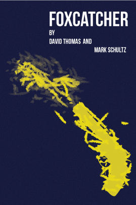

# AAD118

 Imaging and Data Visualisation
 ------------------------------
 
This modual is all about use starting to look at everything with wider eyes. We are starting to look at how everything can effect the outcome of a project from the type that is used to the placing of images. We are looking into photography and thinkg about how the subject matter can be affected by the angle of the photograph and so on. Then the next step it to look at illustrating book covers. With this we are even more so trying to look at ever aspects. As we want to keep the covers connected in some way this could be from the font to the colours used on them. Then we will be lastly looking at how to convay data in a visual way with inforgraphis. We will need to think how we can best represent the data in a clear and meaninful way so that the viewer is left with a clear understanding of the subject of the inforgraphic.  
 
 
 Research for Project 2- Ilustrated Book Covers.
 -----------------------------------------------
 
 So for this porject I was a bit on the fence with it as I have all ready done this last year so I felt like I was back in that mindset. I couldn't get last years idea out of my head for a few day and now that I have actually read the Hobbit and am currently reading The Lord Of The Rings I fell that I could do it more justice than I did my first time. Though I fell that it would be hard for me to get away from what I went for with the covers last time. So I am going to just have to get on with a new idea.
 
I was sitting there in class doing some searching of genres and other books that could possibably be up my ally. When I was doing this Richard Weston aka [Acejet170](http://www.acejet170.typepad.com/) came over and had a chat with me about all kind of different books. What this did was get my mind of the actualy task and let it breath for a moment as I throughing to many logs on it and it was goind out. So after the chat we had I felt something coming back to me about a movie that I watched not to long ago. This movie was Foxcatcher and I would maybe stop reading now if you haven't watched the movie as I am going to spole the ending (sorry).

You watched it yet?
-------------------

So the idea that I had when I had just left the cinema was actually a poster idea but I am going to adapt it into a book cover and if it turns out ok I might then turn it into a poster. So the idea that I have is to have the gun that John du Pont shot, which is a magmuin .44 long barrle. It won't be the gun but a yellow cut out almost if you understand me. Then for the smoke trail I was thinking of having it mak up a fox almost like caught the fox. This is the idea that then brought the genre about which I fell like it the thriller genre. So now that I have the genre I can now start branching out and start thinkng about the two other covers I have todo. 

With the idea for the foxcatcher cover I felt like it should be yellow and blue as that was the colours of there wrestling outfits were. Then the only text on the covers would be the title and the author I have all ready started to look at different fonts that would work well on the front cover but more importantly it will have a tone of thiller in it. 

The two other covers at the moment I want to do is one for the movie Nightcrawler and mayby a cover for Fargo. I am not so sure about Fargo as I can not think of anything good to illustrate, but with Nightcrawler I fell like just having tire tracks on the cover would be cool. I will go more into depth when I think about these two covers in a bit but for now its time for some research, I fell like I am going to be a bit out of my depths as I don't really read thrillers but I am really just looking at the covers so that might really matter.

Research
--------

As all ways I have went on a massive Google search to see what book covers I can draw inspiration from. Sense my genre is thriller I will focuse on book covers from there but will branch out to find book covers from serises. Below you can see why I have picked this book cover and if you can not its because theres a gun on the cover. I looked at this because it is similar to what I want to have for one of the book covers that I am doing. I like how plain it is everywhere else apart from the gun, I fell this tells the viewer that this story will centre around murders that happen by a gun man. I also like the colours used as they represent death, fear and will evoke this in the viewer.

This was one of the first serise of book covers that is found with a similar stlye in them. I really like these as I fell that they represent the books perfectly. The illustrations are the title of the books illustrated in a clever way, usually you don't see this, you just get an illustration from the book itself. So whats similar is the style of illustration and the use of vibrant colours to convey the tone of the book. I like the gritiness and roughness you get from the covers as this is tells you the story will be similar to this.

What I like about this book cover is the type, as thats all there is. You could debate that they have took the type to another level and sort of turned it into an illustation. I like the crack that runs throught the word 'psycho' as to me it  can represent the crack in a persons brain that makes them a psycho. You then have the very basic colour scheme used for the book which helps 'psycho' stand out and seem important. I nearlly forgot about this but I love that that psycho is turned around to fit the whole length of the book. 

This was just a fun project that [Sharm Murugiah](http://www.sharmmurugiah.com/) done with nine movies that Quentin Tarantino has made. Sense I have watched most of the movies I can get all the little parts about the cover. As if you haven't seen Reservoir Dogs it could be a bit confussing to why there are so many hands in different colour on the covers. Then what made me pick this set of book covers is that they have a theme running through out them.

I stumbled apon this book cover and it then threw the movie back into my face as I fell that it represents the moive is such a uniqe way. I like that there is just a little bit of womens hair on the cover sugesting that she is just out of sight that or may be someone was taking a phoyograph and miss framed the shot. Then the use of colour on the cover is very nice indeed, it sets you up to be tricked into thinkong that the girl is inocent as her hair is white and that there is evil around her.

For thsi book cover I have had a similir ideas for my book cover but I fell like it would be hard to pull of for a one of the covers maybe even them all. Any ways I just liked the added level of detail that was put into the cover, I have not read the book. But to  me this cover could be saying that the main potaginist is someone who has a split personality of some kind. What leads me to think this is that is is filled with darkness on the front cover but on the back she is filled with rage and so on. With just righting that last sentance this could represnt how the carachter evolves throughout the book. Like at the start there is danger all around her but she is relitivity safe but in the end it engulfs her.

What drew me to these book covers was that they looked so unique and interesting. I found it interesting that the illustations were made up of dots, as this is what we looked at last semester. I love the use of interestin and vibrant colours, which is draw in the viewers attetion. You then have the continuity through out the covers like the placment of the illustation and of the text. 

With this next set of book covers I love the simplisity of them. You dont have much going on but it still says a lot interms of what the book is about. I have only heard about On The Road before an I fell that it says a lot about the book. Firstly you have the lines creating a road and then you have hte text and tringles at the end of it like its far away. I also like that there are three shapes as this could represnt the charachters that are in the books and the colour of them could be doing this also. Then when you look as them in whole you can clearly see that they are apart of a set and they all work well with being set in the same boundrys.

So the nest book that I found were by a guy called [Yuya Yoshida](https://www.behance.net/yuyayoshida). When I first saw the books I took no real notice of them and just scrolled past them, then on the way back up I stopped and saw that they had so much to them. I just love the fact that he has turned the word maze into a visual representation of itself. I like the fact that they are all very similar to eachother and this was one of the covers that made me start think about the layout of the title and so on. As you can see that on these cover the tiles is set out in a way the you are lead through the cover and into the illustration. As now you are then thrown into a maze and you have to deciffere what it is saying, as it says more than one thing. Then on top of this I find that the colour scheme is so simple but still effective and works so well.  

Ideas
-----

So I have looked at a lot of book covers over the last few weeks and I have started to think about different ways that I could make interesting covers for the books that I am doing. The idea for the foxcatcher cover has stayed the same but I have now thought about the two other cover and came up with ideas for them. So I started of with sketching this cover as I thought of it first andd it will be the most challenging to get right.

As you can se bellow I have all ready started to think about the placement of the text so that it will be seen easily and its clear. I am going to use this to link the covers togeather as the illustrations will be completly different for each cover. I might make changes to it but at the moment it will looks a bit funny as it just a rough sketch. 

Image

When doing this cover I realised that it was not that much help once I got the font sorted out so I quickly finished it and went on to making them in illustrator. You might be thinking that I havn't thought about the other cover but I have and you can see that here below. I know that they are very rough but as before I thought it was better to just get into making them, so instead of having a lot of drawings I have a few versions that I will go through.

Image

So staying with Foxcatcher below you can see my first attempt at the cover. I fell at the moment that this does not look to bad I fell that the gun neeed some work but I really like the fox in the illustration. You can also see the better the idea that I was going for with the title and so on. I fell that this work and the font is strong and shouts at the reader almost.

In this version I have not really done much with anything else apart from trying something different with thw fox. I fell that this is working but it needs more to it, I might try to make a smokey felling so it looks more like the gun has just fired.

After a while the way the title was layed out started to annoy me so I stopped and thought for a second to see what I could do with it. After a while I realised that I could fit it on one line underneath the title, so this is what I have done. I think it works better this way but I fell that another font might look better I will report back and see. As I just realised the font I am using only has capital letters so the authors names can not be in lowercase. I have then add more to the fox and for me it is starting to get there I will add more and maybe take away some in certain places. I still need to mess about with gun but I fell that it looks ok the way it is, i might just take away the lines that are around it.

The next version will just be the finial version of the cover as I could go on for while making changes and showing them.

With Nightcrawler I have decided to go with a single tyre track going down the cover. As in the movie the carracther is speeding about in a car to set where he needs to be. Then on top of that I have decided that the colour of the tyre tracks should be in red as the car is this colour and it also has the conection with death and so on. As I said above I have decided to just jump in and get this started on illustrator.

So you can see below the basic idea that I have had for the cover. I say basic but it has a strong connection with the movie so I fell that it being simple is a plus. You can see at this version that I have stay with the old layout of the title and author. I forgot to draw a point to this on the Foxcatcher cover but the backgrounds have a grainy effect put over it to give them bit more grit.

I realised that I could start to mess with the tyre tracks so on this version I tried to see if I could make it look like the car had taken of fast and skidded at the start. I done this as he drove about really fast throughout the movie and this is another important part of the movie. Then here I still haven't changed the layout of the title and so on.

Now here I have made another change and added a camera as this is one of the biggest parts of the movie. I had thougth about this but put it away and forgot about it, luckly not for ever. So I thought it would look cool it the tyre tracks were coming out of the camera as he films a good bit from his car in a certain scene. At the moment however I fell that it cant really be seen so I am going to work on that and I have made the tyre tracks a good bit smaller so that it fits with in the camera. I have now also changed the title to the new layout an I fell that it works well with this cover. I have also mad another change in this version and that it the font, I went with a different on so that I can have the names of the author in lower case. I fell that it works a lot better this way even though I really like the other font. I nearlly forgot about the blood splatters that I have added, I done this because the whole movie is centered around death and him driving to it. So I thought it would look nice if I added blood splatter around the tyre tracks to signify this. When doing this I accidently place one over the title and haven't moved it sense as I like it. 

I was stuck for a day or two with an idea for the cover of Fargo but I remember a scene which I really liked. In the TV show there is a point were he runs into a wall to injure himself, on this wall is a motivational poster that he runs into. So I thought that it would make for a good cover idea as it would sutitly hint at some one is lossing it and this will then play with the readers head. The poster is a group of fishes swimming one way with one swimming the other way and it has this written on it "What if your rigth and they are wrong". I am then thinking of having the backgound colour as orange as the main characther has this coat which he wears through out the TV show and it have became iconic. I am realising that I am now using the TV show instead of the movie and that is because they have both blurred into one as they follow the same storyline. I am using the creaters of the movie on the cover as the show took their idea and I fell that it would be stupid to put down FOX as the author.

Below is the first version of the cover for Fargo and as you can see everything is similar to what I said it would be. At the point the title and so on are still in the old version, but I realise now the what I am thinking of doing might look funny on this cover as Fargo is such a short word. How ever I really like the whole idea of the cover as it tyes in with the story of th show reather well I fell. I like that the colour scheme goes togeather as I thought that they would clash but in this cas they do not.

I had two other versions but I realised that the change in them is so small even I couldn't remember what was different when I looked at them when writing this. So I have decided to just leave them out and will just finish this on the finial version as I all ready know not much changes with the cover.

So below you can now see the finial versions of the book covers that I have made. I am happy with some parts and not with some but I couldn't get a few things to work. With the Fargo cover I really liked the idea and I knew it was going to be hard to pull of and it was at certain parts. I like the way the fox looks but I would like it to look more smokey and the gun seems to be a bit funny but I tired my best to work it in. I fell over all I have done well on this cover and I have thought in a way were I interrupted the story in a visually unique way, so with this I am most pleased. As I have been told when you get good you can tell other people to make the cover for you.

Then we come to Nightcrawler, this was the toughest of them all. I could not get it to sit right at all. As after I thought about intoducing the camera into the cover I wanted to have it there but it was a pain in butt to get it in. As you can see it is still not as smooth as it could be but I fell like it still gets the idea across. I like the whole feel of the cover as it also tells you a lot about the story in a clever way. I liked the blood splatter on the title so much it has won a place in the finial verson, to me it adds a layer to the title when reading it. I would like to come back and try a few different things with this cover and see if I could make it blend better.  

With the Fargo cover everything went smoother then the rest, with me more and less nailing it on the first version. As I said before I had other versions but the changes were so small I couldn't find them. I is only in the last version that you see a big change, I added more fish that surrond the center fish as it creates more of a tunnel effect so that you are looking at the center fish. I added different blood splatters as when I thought about it, I wanted to create the effect like this was the wall he headbutted and dented the wall. I tried to recreate this with just changing the colour of the blood to make it darker. Over all I like this cover and I fell that it everthing works and I would not change anything in it.

I really liked this project and it has opend my eyes more to the posability that I could be some sort of an art director. Not to sound like an ass but I fell that I think about the thing as a whole and try to see what people will think when they see what ever it is I am doing. At the moment this is more prevolent as I am not that could with bringing my ideas to life so I could just get some else to do it for me.

I almost forgot to put these in. I have done only the spine for foxcatcher as they will more and less be the same for the other covers just the colour and so on will change. Below you can see that I have made up two different spines and I was stuck for a while at which one I liked more.

As I was thinking that both do there job well I kept the foxcatcher big in both as I wanted the word like on the cover to almost be shouting at you and giving of an intense vibe. When it came to adding the author bit I mess about with it, I like both the spines equaly and I still can't see fault in them. In the one above I like how it leads on after the title and in the one below I like that it uses more space and fills up the same amount as the title.

So with that in mine I fell it would be best to go with the second one as it is more jaring when reading it then the first one. I can't help think that this will get the reader thinking in a different mindset then when they look at the cover they will interrupt it in a different way.
