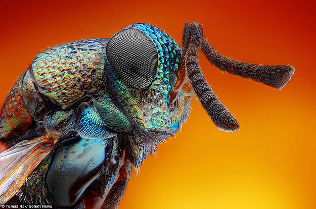
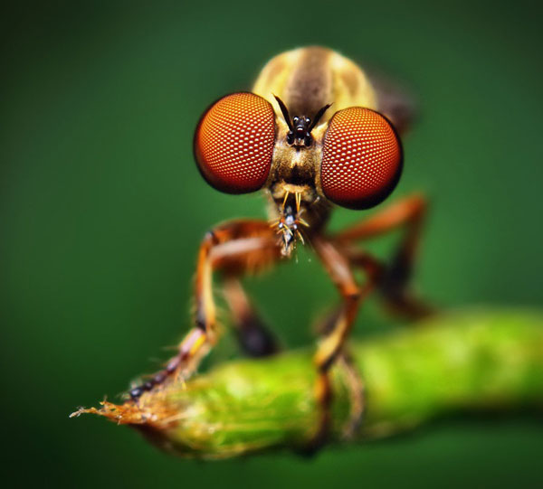

# AAD118

 Imaging and Data Visualisation
 
 
 Research for Project 1- Macro and Micro Photography.
 
 To start of this project I done a  healthy bit of research into other photographers in the field of each category. I was happy when I heard that we were doing a photography project as I love to take photographs given that I don't do it as far often as I should. I would like to start at least once a week going out and taking photographs of nature and other subjects that capture my attention. As I fell that this will give me a better eye in choosing what goes into the end "frame" of what ever I am doing. What I mean by this is that it doesn't matter what you are doing you have to see how everything acts and mixes with each other this can be a piece of text to the position of the photograph that you take.
 
 So to start with I wanted to look at macro photography. Actually before I start I fell like the term macro should not be used for this category as macro is more and less the same as micro photography just a bit further away. So I done a bit of Goggling and saw this, 
 
 
 

as you can see they are the same more and less the same. The only reason I say that is because in the macro one you can only see the fly's eyes not the rest of it. But this is not landscape photography, unless we are meant to take photos of really small buildings.

Any ways that is just a thought that I had on the matter and I keep forgetting to bring it up when I see you, so I thought this would be as a good any place to bring it up.

Macro (Landscape)
=================

With this adventure rightly on it way I started to look for photographers that when I seen their images I felt something that I can' really describe, it just happens when I see a photo I really like.

So I first got this filling when looking at a photographer named [Mike Curry](http://www.mikecurryphotography.com/portfolio). I fell like he is not the most known photographer but he has really nice photos up on his website.

The first one which caught my attention was a photograph he took of the millennium Dome with a long exposure. Some how I all way find my way back to long exposure photography. Well any ways as you can see the image it sell is very chaotic but that's what I like about it you have this sense of excitement in the photograph that you would not get without a longer exposure. Saying that it is not overly long I would say only about 4 seconds at the most as if any long things would start you burn out. Then this is what give you that sense of craziness as you can still clearly see the dome and make out some of the buildings but you have that haze over laying it. I just like the difference in the photos as most would just be happy with shooting it with a normal exposure but I fell like this give of the vibe that London is a busy environment (which it is).

I also like this photo as it is similar to what I want to achieve with my chosen subject for my photographs. with this photograph you fell like you are looking through a portal into another world with the board of leaves that you have around the photograph. Not only this the subject is  centered in the photograph on the x axis which shows it importance in the photograph. Though as I have said it is not completely centered in the photograph with the y axis being different. You have more of the sky in the image, now why has he chosen this who knows. It might be to show the height of the structure how it nearly the sky and towers over its natural surroundings, well its that's one reason why he might have I could spend longer looking at this guy and I might come back and wright about another photograph of his but I fell the ship a calling to start with the next photographer that I have in ready.

The next photographer that I got onto is just a wizard but instead of having a wand/ staff he has a camera. Well he might not be a wizard but he is still very skilled with a camera. How I know this is that one of his photographs has won the landscape photographer of the year, with this image;

Now that you have taken a moment to completely immerse yourself into the photograph it is time to come back. As this is what happened to me when I first saw the photograph I got lost in the endless tonnes of the image chasing something that wasn't there. What got me the most about this photograph is that it looks like an oil painting to me its the good. You then get this felling when looking at the photograph, like something eiry is about to happen, with the ever on setting fog that is coming into lie for the night. Then you have this stream to the left hand side of the photograph which helps break the photograph up, this is not including the different tonnes of the nature in the photo. Any ways back to the stream you have this contrasting colour in this photograph which grabs you attention and starts the journey when looking at the photograph. 

When I was on my late night searching I got to see some fantastic photographers but the next two I fell that the camera is just a mere extention to themselves. I spent hours going down the rabbit hole just looking at this next photographer on his own. Who is the photographer?, you may be asking yourself. The photographer is Ansel Adams, who is a legend in the field of landscape photography. I even like his story, as when he was just beginning in photography he needed to have someone there to tell him to go for it. Then this is when you saw Adams start to blossom into a great photographer as he had the ability to believe in what he was doing. This is what I also think lets people down their ability to believe in themselves to succeed in what they want to do, as in this case if it wasn't for someone else Adams might have never took photography serious.

He all most has to many great photographs to choose from, but most of them got discarded as I was looking for photographs that have a structure in them as this is what we are looking at.

As you can see the photograph is just perfect. It seems that he takes for ever to set up a just one photograph. I fell like this might be the issue because he used a really big camera and its not like what we have to day were the camera does most of the work for you. Anyways, what I like about this photograph in the positioning of the structure in the photograph. You have this dirt road which take up a lot of the photograph leading to this crystal white church, it just takes your eyes on this journey through the photograph. Then it is centered on the x axis as well which show the importance of the structure as well. I also like that the photograph is black and white.

Then this is another one of his photographs that I liked. As you have to structure battling for the spot light in the photograph. It seems that they are in a battle but the more I look at the photograph they work to gather to create the feeling of shelter all most with the for-ground structure sheltering the other structure. You then have this weird effect were it seem to not be centered but it's juxtaposed as the structures are of kilter.

Then the last landscape photographer that I am going to look at is Charlie Waite. Before I get into his photography I would just like to say that he has a very nice monogram indeed. It is just so simple but it works when you see it on his website and when you click through it.

I picked to of his photographs that I liked and this was hard once again but I managed. So with this photograph below I really like it because of it simplicity all it is is a photograph of a spiral stair case. Though you have this divide with the piller of the stairs running down the center of the photograph. Then on top of this I like the way he has only chosen to show a bit of the stairs and left out the floor. As to me I fell like this creates a tension in the photograph, with the stairs spiraling up to the light and spiraling down into the abyss.

Then the last photograph that I am going to look at of his is the one I like the most. As I fell that he has transformed this structure into a colossal mountain with the way he has captured it. He has took it from a low angle and you have the peak of the structure reaching to the blue of the sky just the way any mountain does. Then I love how he has separated the photograph into half with the use of the wall.

Micro
====

